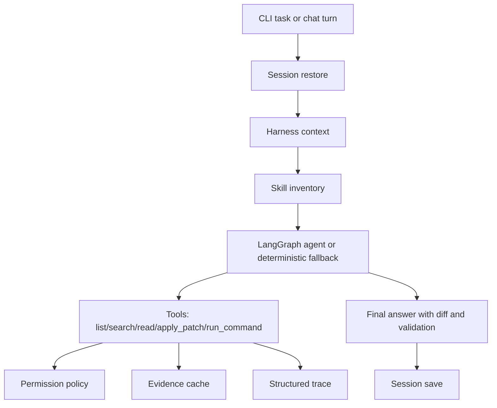

# AI Coding Agent

[中文文档](README.zh-CN.md)

This directory contains a local AI coding agent CLI. The project focuses on the
engineering harness around coding agents: scoped file access, command
permissions, skill loading, planning, structured trace, evidence cache, context
compression, project instructions, repository mapping, and session recovery.

## Entry Point

Run commands from this project directory:

```powershell
cd D:\Code\agent_learning\ai_coding_agent
python aicoding.py config inspect
```

## Project Layout

- `aicoding.py`: CLI entry point.
- `aicoding_app/`: application code.
- `skills/`: task-specific `SKILL.md` files loaded by `load_skill`.
- `runtime/`: generated sessions, traces, and logs.
- `tests/`: automated tests.

## Core Workflow



## Commands

Inspect public configuration without printing secrets:

```powershell
python aicoding.py config inspect
```

Run one task:

```powershell
python aicoding.py run --workspace . --task "replace 'old' with 'new' in app.py"
```

Run a read-only analysis:

```powershell
python aicoding.py ask --workspace . --task "explain the project layout"
```

Create a structured plan without editing files:

```powershell
python aicoding.py plan --workspace . --task "add tests for permissions"
```

Run a focused edit task with the same plan-before-edit safety gate:

```powershell
python aicoding.py edit --workspace . --task "replace 'old' with 'new' in app.py"
```

Run the staged agent loop with trace state transitions:

```powershell
python aicoding.py agent --workspace . --task "replace 'old' with 'new' in app.py"
```

Run the agent loop with conservative pytest auto-repair:

```powershell
python aicoding.py agent --workspace . --task "fix failing tests"
```

Start a multi-turn session:

```powershell
python aicoding.py chat --workspace . --session-id demo
```

Resume a saved session:

```powershell
python aicoding.py resume --session-id demo
```

Show structured trace:

```powershell
python aicoding.py trace show --session-id demo
```

Print repository intelligence:

```powershell
python aicoding.py repo map --workspace .
```

Explain a symbol, file, or pytest failure with repository intelligence:

```powershell
python aicoding.py context explain --workspace . --query "CodingAgent"
python aicoding.py context explain --workspace . --query "aicoding_app/agent.py"
python aicoding.py context explain --workspace . --query "FAILED tests/test_agent.py::test_agent - AssertionError"
```

Run one allowed validation command:

```powershell
python aicoding.py verify --workspace . --command "python -m pytest tests"
```

Print a local git engineering summary:

```powershell
python aicoding.py git summary --workspace .
```

Manage local engineering memory:

```powershell
python aicoding.py memory add --kind command --text "Run python -m pytest tests before PR"
python aicoding.py memory inspect
python aicoding.py memory forget --id mem-12345678
```

Create a dry-run schedule plan:

```powershell
python aicoding.py schedule plan --workspace . --task "run pytest weekly" --cadence weekly
```

Dry-run an eval suite:

```powershell
python aicoding.py eval run --workspace . --suite tests/fixtures/eval_suite.json
```

List connector placeholders:

```powershell
python aicoding.py connectors list
```

Check or clean text hygiene after model edits:

```powershell
python aicoding.py text check --workspace .
python aicoding.py text clean --workspace .
```

## Harness Features

- Skill loading: the agent sees a short inventory and loads full instructions
  only when relevant.
- Planning: edits require a recorded plan before `apply_patch` can mutate files.
- Structured trace: model calls, tool calls, patch application, command results,
  and final responses are written as JSONL.
- Evidence cache: file reads, searches, commands, patches, and skills are cached
  as summaries for later turns.
- Context compression: session context preserves the current plan, recent turns,
  project instructions, repository map, cached evidence, and latest diff within
  a token budget.
- Permission policy: file operations are scoped to `--workspace`, and commands
  must match the configurable whitelist.
- Project instructions: `AGENTS.md` and `.aicoding/AGENTS.md` are loaded into
  context when present.
- Repository map: file inventory, dependency files, test roots, Python symbols,
  and imports are available through `repo map` and the `repo_map` tool.
- Context explain: symbols, files, imports, reverse imports, source/test
  relationships, and pytest failure output can be explained through
  `context explain` and the `explain_context` tool.
- Patch preview: `preview_patch` validates paths and hunk matches without
  modifying files.
- Validation: `verify` and `run_validation` run only whitelisted commands and
  attach pytest failure context when available.
- Auto repair loop: `agent` can run pytest, parse failures, apply a narrow
  deterministic repair for simple assertion/return-value mismatches, and
  re-run validation. It does not weaken tests or attempt broad rewrites.
- Git summary: `git summary`, `git_commit_preview`, and PR-ready summaries help
  prepare a local change for review. They do not commit, push, or create PRs.
- Hooks: `.aicoding/config.toml` can define `after_verify` hooks; Phase 3 only
  previews whether they are allowed by policy and does not execute them.
- Memory: `memory add/inspect/forget` stores local engineering facts in
  `runtime/memory.json` and rejects text that looks like secrets.
- Schedule planning: `schedule plan` produces a dry-run plan only; it does not
  register a Windows task or run anything in the background.
- Eval harness: `eval run` reads a JSON suite and prints a dry-run summary; it
  does not call models, edit files, or run validation commands.
- Connectors: `connectors list` reports disabled/read-only GitHub/MCP
  placeholders. No external API calls are made.
- Text hygiene: `text check` reports non-ASCII characters without modifying
  files; `text clean` applies conservative replacements for common mojibake and
  typographic punctuation.

## Model Configuration

Copy `.env.example` to `.env` and configure an OpenAI-compatible endpoint:

```env
AICODING_MODEL_API_KEY=<provider-api-key>
AICODING_MODEL_API_BASE=https://api.deepseek.com
AICODING_MODEL_NAME=deepseek-v4-flash
```

Without a configured model, the CLI still supports deterministic demo edits:

- `create <path> with "content"`
- `set <path> to "content"`
- `append "content" to <path>`
- `replace "old" with "new" in <path>`

## Quality Checks

```powershell
python -m pytest tests
python -m ruff check .
python -m pyright
```
