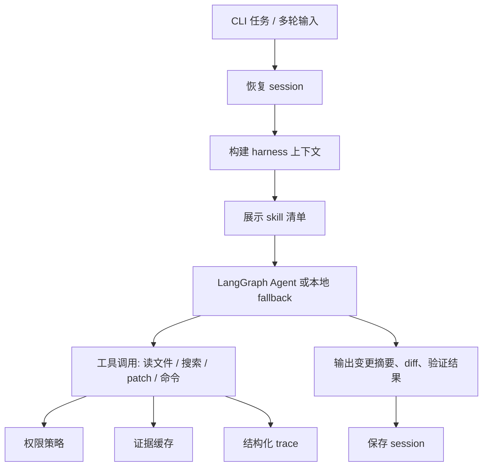

# AI Coding Agent

这是一个本地 AI coding agent CLI 项目，重点展示 coding agent 的 harness 工程能力：文件权限、命令白名单、skill loading、计划状态、结构化 trace、证据缓存、项目指令、仓库映射、上下文压缩和会话恢复。

请在本项目目录内运行命令：

```powershell
cd D:\Code\agent_learning\ai_coding_agent
```

## 项目结构

- `aicoding.py`：CLI 入口。
- `aicoding_app/`：核心应用代码。
- `skills/`：可通过 `load_skill` 加载的 coding 策略文件。
- `runtime/`：运行时生成的 session、trace 和日志。
- `tests/`：自动化测试。

## 基本流程



## 常用命令

检查配置，不泄露密钥：

```powershell
python aicoding.py config inspect
```

执行一次性任务：

```powershell
python aicoding.py run --workspace . --task "replace 'old' with 'new' in app.py"
```

只读分析，不修改文件、不运行命令：

```powershell
python aicoding.py ask --workspace . --task "explain the project layout"
```

只生成结构化计划，不修改文件：

```powershell
python aicoding.py plan --workspace . --task "add tests for permissions"
```

执行受 plan-before-edit 保护的精准编辑：

```powershell
python aicoding.py edit --workspace . --task "replace 'old' with 'new' in app.py"
```

执行带状态 trace 的 agent 流程：

```powershell
python aicoding.py agent --workspace . --task "replace 'old' with 'new' in app.py"
```

执行带保守 pytest 自动修复的 agent 流程：

```powershell
python aicoding.py agent --workspace . --task "fix failing tests"
```

进入多轮会话：

```powershell
python aicoding.py chat --workspace . --session-id demo
```

恢复会话：

```powershell
python aicoding.py resume --session-id demo
```

查看 trace：

```powershell
python aicoding.py trace show --session-id demo
```

启动本地 Trace Web UI：

```powershell
python aicoding.py trace serve
python aicoding.py trace serve --session-id demo --port 8765
```

查看仓库映射：

```powershell
python aicoding.py repo map --workspace .
```

解释符号、文件或 pytest 失败输出：

```powershell
python aicoding.py context explain --workspace . --query "CodingAgent"
python aicoding.py context explain --workspace . --query "aicoding_app/agent.py"
python aicoding.py context explain --workspace . --query "FAILED tests/test_agent.py::test_agent - AssertionError"
```

运行一个白名单允许的验证命令：

```powershell
python aicoding.py verify --workspace . --command "python -m pytest tests"
```

查看本地 git 工程摘要：

```powershell
python aicoding.py git summary --workspace .
```

管理本地工程记忆：

```powershell
python aicoding.py memory add --kind command --text "Run python -m pytest tests before PR"
python aicoding.py memory inspect
python aicoding.py memory forget --id mem-12345678
```

生成定时任务 dry-run 计划：

```powershell
python aicoding.py schedule plan --workspace . --task "run pytest weekly" --cadence weekly
```

dry-run 评估任务集：

```powershell
python aicoding.py eval run --workspace . --suite tests/fixtures/eval_suite.json
```

查看 connector 占位能力：

```powershell
python aicoding.py connectors list
```

检查或清理模型编辑后的文本卫生：

```powershell
python aicoding.py text check --workspace .
python aicoding.py text clean --workspace .
```

## Harness 能力

- Skill loading：Agent 初始只看到 skill 清单，需要时再加载完整策略。
- Coding plan：自动修改前必须先记录目标、修改步骤、验证步骤和风险。
- Structured trace：模型调用、工具调用、patch、命令执行和最终回答写入 JSONL。
- Trace Web UI：`trace serve` 启动本地浏览器界面，读取 `runtime/traces`，展示 session 摘要、工具调用时间线、验证命令、失败/拒绝调用和最终回答；同时提供安全版 Web Run 面板，支持 `ask`、`plan`、`edit`、`agent`，提交的 workspace 必须是项目根目录或 `runtime/` 下的目录。
- Evidence cache：缓存文件片段、搜索结果、命令输出、patch 和 skill 内容摘要。
- Context compression：保留项目指令、仓库映射、当前计划、最近会话、证据摘要和最新 diff。
- Permission policy：文件访问限制在 `--workspace` 内，命令必须命中白名单。
- Project instructions：自动加载 `AGENTS.md` 和 `.aicoding/AGENTS.md`。
- Repo map：输出文件清单、依赖文件、测试目录、Python 符号和 import 信息。
- Context explain：根据符号、文件、import/reverse import、源文件/测试文件关联和 pytest 失败输出定位上下文。
- Patch preview：`preview_patch` 可在不修改文件的情况下验证路径和 hunk 是否匹配。
- Validation：`verify` 和 `run_validation` 只运行白名单命令，并在 pytest 失败时附带失败上下文。
- Auto repair loop：`agent` 可运行 pytest、解析失败、对简单断言/返回值不匹配应用窄范围 deterministic 修复并重跑验证；不会削弱测试或进行大范围重写。
- Git summary：`git summary`、`git_commit_preview` 和 PR-ready summary 用于准备本地 review，不会自动 commit、push 或创建 PR。
- Hooks：`.aicoding/config.toml` 可配置 `after_verify`，当前阶段只预览是否被白名单允许，不执行 hook。
- Memory：`memory add/inspect/forget` 将工程事实保存在 `runtime/memory.json`，并拒绝疑似密钥内容。
- Schedule planning：`schedule plan` 只生成 dry-run 计划，不创建 Windows 定时任务，也不后台运行。
- Eval harness：`eval run` 读取 JSON 任务集并输出 dry-run 摘要，不调用模型、不改文件、不运行验证命令。
- Connectors：`connectors list` 只展示 disabled/read-only 的 GitHub/MCP 占位接口，不进行外部 API 调用。
- Text hygiene：`text check` 只报告非 ASCII 字符，不修改文件；`text clean` 对常见 mojibake 和排版标点做保守替换。

## 模型配置

复制 `.env.example` 为 `.env`：

```env
AICODING_MODEL_API_KEY=<provider-api-key>
AICODING_MODEL_API_BASE=https://api.deepseek.com
AICODING_MODEL_NAME=deepseek-v4-flash
```

没有模型配置时，CLI 仍支持确定性演示编辑：

- `create <path> with "content"`
- `set <path> to "content"`
- `append "content" to <path>`
- `replace "old" with "new" in <path>`

## 质量检查

```powershell
python -m pytest tests
python -m ruff check .
python -m pyright
```
